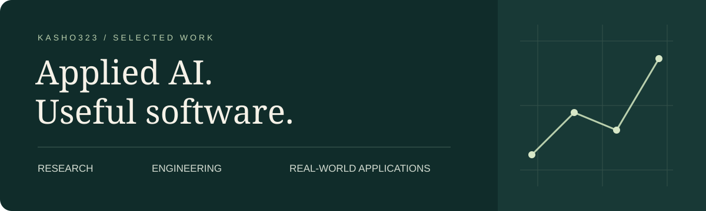

I build AI tools and practical software, with an emphasis on inspectable results, clear interfaces, and reproducible work.

我关注能被验证、能被理解、能在真实场景中使用的 AI 与软件。

[Selected work](#selected-work) · [Project index](PROJECTS.md) · [Repositories](https://github.com/Kasho323?tab=repositories)

## Selected work

| Area | Project | What to explore |
|---|---|---|
| **Research & evaluation** | [Local SLM Benchmark](https://github.com/Kasho323/msc-dissertation-slm-benchmark) | Six local model configurations, retained experimental evidence, and a command to reproduce the reported statistics. |
| **AI engineering** | [Codebase Explainer Agent](https://github.com/Kasho323/codebase-explainer-agent) | Python symbol graphs, semantic retrieval, and an agent that links answers to source locations. |
| **Applied software** | [Kasho Hotel](https://github.com/Kasho323/kasho-hotel) | A local front-desk system for a 13-room hotel: room allocation, imported bookings, multi-night stays, and fee reconciliation. |

## Data & analytics

- **[Diabetes Risk Prediction](https://github.com/Kasho323/diabetes-risk-prediction)** — a notebook-based ML study with a separate five-input Streamlit demonstration.
- **[COVID Data Pipeline](https://github.com/Kasho323/covid-data-pipeline)** — CSV ingestion, data cleaning, SQLite persistence, and visualisation.
- **[Basket Graph Analytics](https://github.com/Kasho323/basket-graph-analytics)** — co-occurrence graphs, frequent pairs, and two-hop product associations.
- **[Asset Dashboard](https://github.com/Kasho323/asset-dashboard)** — a browser-based portfolio and recurring-investment tracker.

## How I approach projects

**Trace the result.** Connect claims to code, tests, retained evidence, or a reproducible command.

**Make the next step clear.** Document what runs locally, what needs external services, and what remains unfinished.

**Design around the actual workflow.** Keep routine actions simple and make exceptions visible.

Python · TypeScript · React · SQLite · scikit-learn · tree-sitter · LLM tool use

Explore [the project index](PROJECTS.md) for entry points, evidence, and current boundaries.
